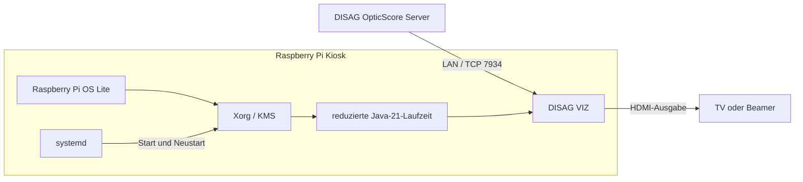

# DISAG VIZ Raspberry-Pi-Kiosk

Ich nutze dieses Projekt, um die DISAG-OpticScore-Visualisierung als kleines Kiosk-Image auf einem Raspberry Pi 3, 4 oder 5 zu betreiben. Das Image startet direkt in die Visualisierung, zeigt beim Booten das Vereinslogo und startet die Anwendung nach einem Absturz neu.

Erstellt von **Websmack** für den Schützenverein Völkersen.

## Aufbau



Der Fernseher wird über KMS/DRM erkannt. Beim Pi 5 wird die DRM-Karte mit HDMI-Anschluss dynamisch ausgewählt, weil sich die Kartennummern ändern können. Netzwerk wird per LAN und DHCP eingerichtet. Die Vorgabe für den DISAG-Server steht in `kiosk/disag.txt`.

## Projektdateien

| Pfad | Im Git | Zweck |
|---|:---:|---|
| `build-image.sh` | ✅ | Einziger Einstiegspunkt für einen vollständigen Build. |
| `DISAG-VIZ/` | ❌ | Lokal abgelegte DISAG-Anwendung. Wird nicht in Git aufgenommen. |
| `cache/` | ❌ | Raspberry-Pi-OS-Basisimage und dessen SHA256-Datei. Wird nicht in Git aufgenommen. |
| `images/SVV_Logo.png` | ✅ | Originales Vereinslogo. |
| `tools/prepare-logo.sh` | ✅ | Erstellt daraus unter Linux/WSL die zentrierte 1920×1080-Bootgrafik. |
| `tools/prepare-logo.ps1` | ✅ | PowerShell-Variante der Logo-Vorbereitung. |
| `kiosk/install.sh` | ✅ | Installiert Xorg, Java, Plymouth, Netzwerk und systemd-Dienste ins Image. |
| `kiosk/session.sh` | ✅ | Startet Openbox und die DISAG-Anwendung und überwacht beide. |
| `kiosk/disag-kiosk.service` | ✅ | systemd-Dienst für Autostart und Neustart. |
| `kiosk/wait-display.sh` | ✅ | Findet die zum HDMI-Anschluss gehörende DRM-Karte. |
| `kiosk/display.py` | ✅ | Wählt den aktiven HDMI-Ausgang und dessen bevorzugte Auflösung. |
| `kiosk/settings.py` | ✅ | Übernimmt Server-IP, Port und VIZ-Namen von der Bootpartition. |
| `kiosk/compact-java.sh` | ✅ | Erzeugt mit `jdeps` und `jlink` eine kleine Java-Laufzeit. |
| `kiosk/minimize.sh` | ✅ | Entfernt Entwicklungs-, Cloud- und nicht benötigte Pakete. |
| `kiosk/finish-logo.sh` | ✅ | Baut Logo und Plymouth-Theme in beide Initramfs-Varianten ein. |
| `kiosk/smoke-test.sh` | ✅ | Prüft ARM-Java-Start und Neustart nach einem simulierten Absturz. |
| `kiosk/finalize.sh` | ✅ | Verkleinert das Dateisystem und erzeugt `.img.xz` samt SHA256. |
| `output/` | ❌ | Lokale Buildausgabe und späteres Release-Asset. Bleibt außerhalb von Git. |

✅ = im Repository vorhanden, ❌ = wird lokal bereitgestellt oder erzeugt und nicht in Git aufgenommen.

Die übrigen Dateien in `kiosk/` sind Konfigurationen oder kleine Prüfwerkzeuge, die von diesen Schritten verwendet werden.

## Voraussetzungen

Der eigentliche Build muss in einer Linux-Umgebung mit Root-Rechten laufen, weil die Skripte Loop-Geräte, `mount`, `chroot` und `binfmt_misc` verwenden. Unter Windows dient dafür WSL2, unter macOS eine Linux-VM. Ein nativer Build direkt in Windows, PowerShell oder macOS wird nicht unterstützt.

In der Linux-Umgebung werden benötigt:

- `qemu-aarch64-static` ab Version 8
- `e2fsprogs` ab Version 1.47.2
- `parted`, `zerofree`, `xz`, `ffmpeg`, `curl`, Python 3
- OpenJDK 17 oder neuer, Xvfb und X11-Werkzeuge für den Starttest
- mindestens 12 GB freier Speicher

Beispiel für Debian 13:

```bash
sudo apt update
sudo apt install qemu-user-static binfmt-support e2fsprogs parted zerofree xz-utils \
  python3 ffmpeg curl openjdk-17-jdk-headless xvfb x11-utils
```

## Basisimage herunterladen

Der Build benötigt das aktuelle **Raspberry Pi OS Lite ARM64** und die dazugehörige offizielle SHA256-Datei. Beide Dateien werden unter festen Namen im lokalen, von Git ausgeschlossenen Ordner `cache/` abgelegt:

```bash
mkdir -p cache
curl -fL https://downloads.raspberrypi.com/raspios_lite_arm64_latest \
  -o cache/base.img.xz
curl -fL https://downloads.raspberrypi.com/raspios_lite_arm64_latest.sha256 \
  -o cache/base.sha256
```

Danach lässt sich der Download manuell prüfen. `build-image.sh` führt dieselbe Prüfung vor jedem Build automatisch aus:

```bash
expected=$(awk '{print $1}' cache/base.sha256)
echo "$expected  cache/base.img.xz" | sha256sum -c -
```

## Build vorbereiten

1. Repository auschecken und in das Projekt wechseln.
2. Im DISAG-Kundenbereich die lizenzierte VIZ-Software herunterladen und den **Inhalt** des ZIP-Archivs nach `DISAG-VIZ/` entpacken. Danach muss `DISAG-VIZ/classes/BeamerView.class` existieren.
3. Das aktuelle **Raspberry Pi OS Lite ARM64** wie unter [Basisimage herunterladen](#basisimage-herunterladen) beschrieben in `cache/` ablegen.
4. Bei Bedarf `kiosk/disag.txt` bearbeiten:

   ```ini
   serverip=192.168.0.101
   serverport=7934
   vizname=SV-Völkersen-VIZ
   ```

5. Bootlogo vorbereiten. Unter Linux beziehungsweise WSL das Bash-Skript verwenden:

   ```bash
   ./tools/prepare-logo.sh
   ```

   Unter Windows steht alternativ das PowerShell-Skript zur Verfügung:

   ```powershell
   powershell -ExecutionPolicy Bypass -File .\tools\prepare-logo.ps1
   ```

6. Skripte ausführbar machen:

   ```bash
   chmod +x build-image.sh kiosk/*.sh
   ```

Danach den Build mit der Anleitung für das verwendete Betriebssystem starten.

## Image unter Linux erstellen

Unter Debian 13 oder einer vergleichbaren Linux-Distribution die unter [Voraussetzungen](#voraussetzungen) genannten Pakete installieren, das Repository vorbereiten und im Projektverzeichnis ausführen:

```bash
sudo ./build-image.sh
```

## Image unter Windows erstellen

Der Build läuft unter Windows in **WSL2**. Zuerst PowerShell als Administrator öffnen und Debian installieren:

```powershell
wsl --install -d Debian
```

Windows neu starten, falls dazu aufgefordert wird. Anschließend Debian öffnen und alle weiteren Befehle innerhalb von WSL ausführen:

```bash
sudo apt update
sudo apt install qemu-user-static binfmt-support e2fsprogs parted zerofree xz-utils \
  python3 ffmpeg openjdk-17-jdk-headless xvfb x11-utils git curl
git clone https://github.com/Websmack/raspberry-disag-viz.git
cd raspberry-disag-viz
```

Das Projekt sollte im Linux-Dateisystem von WSL, zum Beispiel unter `~/raspberry-disag-viz`, und nicht unter `/mnt/c/` liegen. Danach die Schritte unter [Build vorbereiten](#build-vorbereiten) ausführen und den Build starten:

```bash
sudo ./build-image.sh
```

Das fertige Image kann bei Bedarf nach Windows kopiert werden:

```bash
cp output/voelkersen-disag-pi3-pi5.img.xz /mnt/c/Users/DEIN-BENUTZERNAME/Downloads/
```

## Image unter macOS erstellen

Unter macOS wird eine Linux-VM benötigt, beispielsweise Debian 13 in UTM, VMware Fusion oder Parallels. Der VM mindestens 4 CPU-Kerne, 8 GB RAM und 25 GB freien Plattenplatz zuweisen. Das gilt sowohl für Intel-Macs als auch für Apple-Silicon-Macs. Auf einem ARM64-Linux-Gastsystem läuft das Raspberry-Pi-System nativ; auf anderen Architekturen verwendet der Build QEMU.

In der VM ein Terminal öffnen und ausführen:

```bash
sudo apt update
sudo apt install qemu-user-static binfmt-support e2fsprogs parted zerofree xz-utils \
  python3 ffmpeg openjdk-17-jdk-headless xvfb x11-utils git curl
git clone https://github.com/Websmack/raspberry-disag-viz.git
cd raspberry-disag-viz
```

Danach die Schritte unter [Build vorbereiten](#build-vorbereiten) ausführen und innerhalb der VM bauen:

```bash
sudo ./build-image.sh
```

Das fertige `.img.xz` anschließend über einen freigegebenen VM-Ordner, `scp` oder einen USB-Datenträger nach macOS kopieren. Docker Desktop wird für diesen Build nicht empfohlen, weil der Build privilegierten Zugriff auf Loop-Geräte, Mounts und `binfmt_misc` benötigt.

## Ergebnis prüfen

Nach einem erfolgreichen Build die erzeugte Prüfsumme kontrollieren:

```bash
cd output
sha256sum -c voelkersen-disag-pi3-pi5.img.xz.sha256
```

Der Build entfernt einen alten Arbeitsstand unter `/var/tmp/disag-kiosk-build`, prüft aber vorher, dass davon nichts mehr eingehängt ist. Das fertige Image liegt ausschließlich unter `output/voelkersen-disag-pi3-pi5.img.xz`.

## Eingeschränkter QEMU-Test

Mit QEMU lassen sich Kernel, Initramfs, SD-Partitionen, ext4 und der systemd-Start als Raspberry Pi 3B testen. Unter macOS werden dafür `brew install qemu xz mtools`, unter Debian `sudo apt install qemu-system-arm xz-utils mtools` benötigt. Zuerst Image und Bootdateien vorbereiten:

```bash
mkdir -p qemu-rpi3
xz -dc output/voelkersen-disag-pi3-pi5.img.xz > qemu-rpi3/sdcard.img
mcopy -i qemu-rpi3/sdcard.img@@8388608 ::kernel8.img qemu-rpi3/kernel8.img
mcopy -i qemu-rpi3/sdcard.img@@8388608 ::bcm2710-rpi-3-b.dtb qemu-rpi3/bcm2710-rpi-3-b.dtb
mcopy -i qemu-rpi3/sdcard.img@@8388608 ::initramfs8 qemu-rpi3/initramfs8
truncate -s 4G qemu-rpi3/sdcard.img
```

Danach den seriellen Boot-Test starten:

```bash
qemu-system-aarch64 \
  -M raspi3b \
  -kernel qemu-rpi3/kernel8.img \
  -dtb qemu-rpi3/bcm2710-rpi-3-b.dtb \
  -initrd qemu-rpi3/initramfs8 \
  -drive file=qemu-rpi3/sdcard.img,format=raw,if=sd \
  -append "rw root=/dev/mmcblk0p2 rootfstype=ext4 rootwait earlycon=pl011,mmio32,0x3f201000 console=ttyAMA1,115200 watchdog_disarm=0 loglevel=7 systemd.show_status=true plymouth.enable=0 systemd.mask=disag-kiosk.service" \
  -display none \
  -monitor none \
  -serial stdio
```

Ein erfolgreicher Test erreicht `Welcome to Debian GNU/Linux 13 (trixie)!`. QEMU mit `Strg`+`C` beenden. Der Kiosk-Dienst wird absichtlich maskiert, da QEMU die VideoCore-/KMS-/HDMI-Hardware nicht vollständig emuliert. Bootlogo, Xorg, HDMI und die DISAG-Oberfläche müssen deshalb auf einem echten Raspberry Pi 3 geprüft werden.

## Auf den Raspberry Pi übertragen

1. [Raspberry Pi Imager](https://www.raspberrypi.com/software/) öffnen.
2. Unter „Betriebssystem wählen“ ein eigenes Image auswählen.
3. `output/voelkersen-disag-pi3-pi5.img.xz` auswählen; Entpacken ist nicht nötig.
4. microSD-Karte wählen und schreiben. Dabei wird ihr bisheriger Inhalt gelöscht.
5. Keine zusätzlichen Benutzer- oder WLAN-Einstellungen im Imager setzen.
6. SD-Karte, LAN und HDMI anschließen und den Pi starten.

Die sichtbare `bootfs`-Partition enthält `disag.txt`. Damit lassen sich Server-IP, Port und Anzeigename ohne neuen Build ändern. Der lokale Diagnosezugang liegt auf `Strg`+`Alt`+`F2`:

```text
Benutzer: svvdiag
Passwort: SVV1905!
```

Das Konto besitzt keine `sudo`-Rechte. Kiosk-Protokoll:

```bash
journalctl -u disag-kiosk -b
```

## DISAG-Version austauschen

1. Neue VIZ-Version aus dem [DISAG-Kundenbereich](https://www.disag.de/login/) herunterladen.
2. Den bisherigen lokalen Ordner `DISAG-VIZ/` sichern und anschließend vollständig leeren. Alte Klassen oder Bibliotheken sollen nicht mit einer neuen Version vermischt werden.
3. Den Inhalt des neuen VIZ-ZIP-Archivs nach `DISAG-VIZ/` entpacken.
4. Prüfen, ob `classes/`, `lib/`, `config/` und `classes/BeamerView.class` vorhanden sind.
5. `sudo ./build-image.sh` erneut ausführen.
6. Anwendung und Verbindung zum echten OpticScore-Server testen.

`jdeps` ermittelt bei jedem Build die benötigten Java-Module neu. Falls DISAG den Startklassennamen oder das Verzeichnislayout ändert, müssen `kiosk/session.sh` und die Dateiprüfung in `build-image.sh` angepasst werden.

## Linux-Basisimage aktualisieren

1. Neues Raspberry Pi OS Lite ARM64 samt offizieller SHA256-Datei herunterladen.
2. `cache/base.img.xz` und `cache/base.sha256` ersetzen.
3. Versionen von QEMU und e2fsprogs prüfen.
4. Image mit `sudo ./build-image.sh` komplett neu bauen.
5. Start, Logo, HDMI-Hotplug, LAN, App-Neustart und Verbindung zum DISAG-Server auf realer Hardware testen.

Der Build erwartet die übliche Raspberry-Pi-OS-Aufteilung: FAT-Bootpartition 1 und ext4-Rootpartition 2. Ändert Raspberry Pi dieses Layout oder Paketnamen, müssen die Buildskripte angepasst werden.

## Eigenes Vereinslogo

1. Eigenes Logo als PNG unter `images/SVV_Logo.png` ablegen.
2. Bootgrafik erzeugen:

   Linux beziehungsweise WSL:

   ```bash
   ./tools/prepare-logo.sh
   ```

   Windows PowerShell:

   ```powershell
   powershell -ExecutionPolicy Bypass -File .\tools\prepare-logo.ps1
   ```

3. Die erzeugte Datei `kiosk/boot-splash.png` kontrollieren.
4. Image neu bauen.

Das Logo wird proportional auf höchstens 60 Prozent der 1920×1080-Bootfläche skaliert und auf schwarzem Hintergrund zentriert.

## GitHub-Release

Images gehören nicht in die Git-Historie. Nach geklärten Weitergaberechten kann das lokale Image als Release-Asset hochgeladen werden, zum Beispiel:

```bash
gh release create v1.0.0 \
  output/voelkersen-disag-pi3-pi5.img.xz \
  output/voelkersen-disag-pi3-pi5.img.xz.sha256 \
  --title "DISAG VIZ Raspberry Pi Kiosk v1.0.0"
```

## Herkunft und Rechte

Die Visualisierungssoftware stammt von [DISAG](https://www.disag.de), laut [Impressum](https://www.disag.de/impressum/) von der **DISAG GmbH & Co KG**. Der offizielle Bezug und die Aktualisierung erfolgen über den DISAG-Kundenbereich; nach der [DISAG-Dokumentation](https://dokumentation.disag.de/dokumentation/anleitung/anleitung-visualisierungssoftware/) kann dafür eine passende Lizenz erforderlich sein.

Dieses Projekt ist ein privates, inoffizielles Kiosk-Buildprojekt von Websmack und steht in keiner geschäftlichen Verbindung zu DISAG. DISAG, OpticScore, die Software, Logos und weitere Kennzeichen gehören ihren jeweiligen Rechteinhabern. Ich verteile im Git-Repository keine DISAG-Programmdateien und beanspruche daran keine Rechte. Vor einer öffentlichen Veröffentlichung des fertigen Images muss geklärt sein, dass die enthaltene DISAG-Software und das verwendete Vereinslogo weitergegeben werden dürfen. Für Betrieb, Datenverlust und Kompatibilität übernehme ich keine Gewähr.
